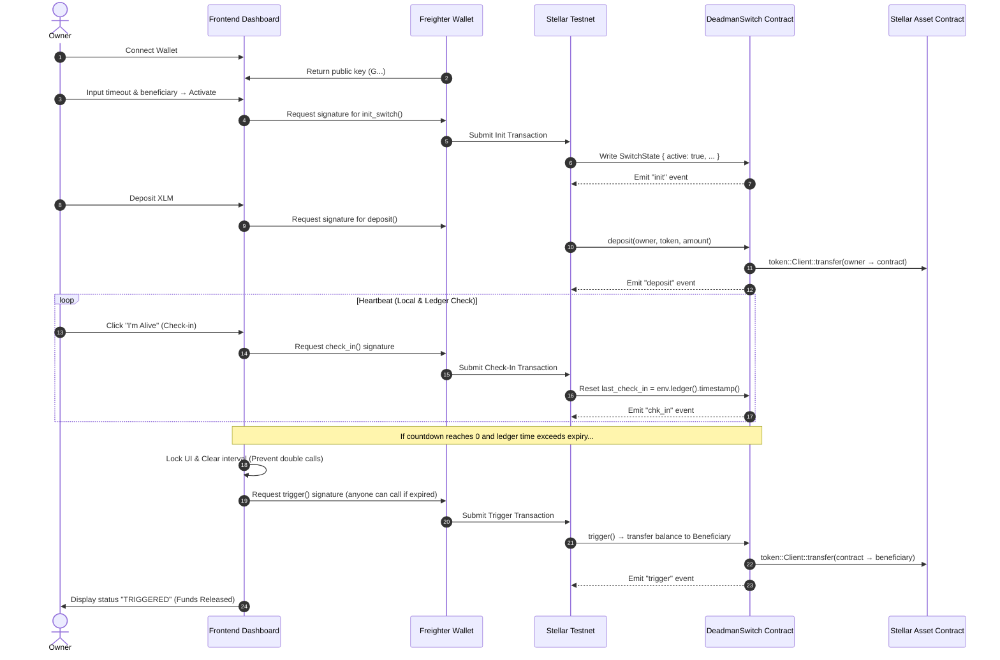

# Deadman Switch 🚀

[](https://github.com/ssohini/deadman-switch/actions)
🚀 Automated CI/CD pipeline with GitHub Actions  
✅ Smart contract + frontend tested on every commit  
⚡ Build time ~1–2 minutes

🚀 Project Demo

## 🚀 Project Demo

🌐 **Live Website**
👉 [Deadman Switch Stellar](https://deadman-switch-stellar.netlify.app/)

🎥 **Demo Video**
[](https://www.youtube.com/watch?v=TauFTt6bW5g)


# 🛡️ Secure Switch Protocol (Soroban Deadman Switch)

[](https://stellar.org)
[](https://github.com/ssohini/deadman-switch/actions)
[](https://opensource.org/licenses/MIT)

An advanced, production-ready **Deadman Switch** protocol built on the **Stellar Soroban Smart Contract platform**. This application provides a decentralized mechanism to automatically transfer holdings to a beneficiary address if the owner fails to "check in" before a specified countdown timeout.

Designed with a high-fidelity retro-security terminal aesthetic, the frontend is **fully mobile-responsive**, animated, and integrates directly with the **Freighter Wallet** for secure on-chain key management and transaction signing.

---

## ⚡ Core Features

| Category | Feature |
|---|---|
| **Advanced Smart Contract** | Custom error types (`#[contracterror]`), structured types (`#[contracttype]`), persistent storage, `require_auth()` |
| **Inter-Contract Communication** | Integrates with Stellar Asset Contract via `token::Client` for deposits & fund releases |
| **Event Streaming** | Contract emits 5 on-chain events (`init`, `reset`, `deposit`, `chk_in`, `trigger`); frontend polls `getEvents()` every 10s |
| **CI/CD Pipeline** | GitHub Actions builds WASM, runs tests, and uploads artifacts on every push/PR |
| **Deployment Workflow** | Automated `scripts/deploy.sh` handles WASM build, optimization, deploy, and frontend config update |
| **Mobile Responsive** | Full responsive CSS with breakpoints at 768px and 480px; viewport-aware layout |
| **Error Handling & Loading** | Human-readable error mapping, XDR decoding, button loading spinners with pulse animation |
| **Contract & Frontend Tests** | 3 Rust unit tests (`cargo test`) + frontend smoke tests (`npm test`) |
| **Production Architecture** | `.gitignore`, env constants, `localStorage` persistence, clean `contract/` + frontend separation |
| **Documentation** | Mermaid architecture diagrams, CLI examples, timing parameter docs, method reference table |

---

## 🏗️ Architecture & Control Flow



---

## 📂 Project Structure

```
deadman-switch/
├── .github/
│   └── workflows/
│       └── ci.yml               # CI/CD: build WASM, run tests, upload artifact
├── contract/
│   ├── src/
│   │   ├── lib.rs               # Soroban smart contract (7 endpoints, 5 events)
│   │   └── test.rs              # Rust unit tests (3 test suites)
│   ├── Cargo.toml               # Contract dependencies & build config
│   ├── Cargo.lock
│   └── test_snapshots/          # Test snapshot data
├── scripts/
│   └── deploy.sh                # Automated WASM build & deploy script
├── tests/
│   └── frontend.test.js         # Frontend smoke tests
├── app.js                       # Frontend: Soroban RPC, event streaming, UI logic
├── index.html                   # Dashboard interface (mobile responsive)
├── style.css                    # CSS: glassmorphism, animations, responsive breakpoints
├── package.json                 # npm scripts (dev, test)
├── .gitignore                   # Excludes target/, node_modules/, .env
└── README.md                    # This file
```

---

## 🛠️ Getting Started

### 📋 Prerequisites
- **Node.js** (v16+)
- **Freighter Wallet Extension** installed in browser
- **Rust** & **Cargo** (with `wasm32-unknown-unknown` target)
- **Stellar CLI** for contract management

### 🚀 Running the Web App Locally

```bash
# 1. Clone the repository
git clone https://github.com/ssohini/deadman-switch.git
cd deadman-switch

# 2. Install dependencies
npm install

# 3. Start the local development server
npm run dev

# 4. Open http://127.0.0.1:3000 in your browser
```

---

## ⚙️ Smart Contract Methods

| Endpoint | Caller | Description |
|---|---|---|
| `init_switch(owner, beneficiary, timeout)` | Owner | Initializes a new switch. Fails if already active. |
| `check_in(owner)` | Owner | Resets the countdown clock to current ledger timestamp. |
| `deposit(owner, token, amount)` | Owner | Deposits assets into the contract's escrow. |
| `reset_switch(owner)` | Owner | Explicitly deactivates/cancels the switch. |
| `trigger(owner, token)` | Anyone | If ledger time exceeds `last_check_in + timeout`, transfers funds to beneficiary. |
| `is_expired(owner)` | Anyone | Returns `true` if timeout window has passed on-chain. |
| `get_switch(owner)` | Anyone | Returns current `SwitchState` or `None`. |

### 📡 On-Chain Events

| Event | Published When | Data |
|---|---|---|
| `init` | Switch initialized | `(beneficiary, timeout, timestamp)` |
| `reset` | Switch deactivated | `()` |
| `deposit` | Funds deposited | `amount` |
| `chk_in` | Owner checks in | `timestamp` |
| `trigger` | Emergency triggered | `(beneficiary, balance)` |

---

## 🔧 Smart Contract Build & Deployment

### Build the WASM

```bash
cd contract
cargo build --release --target wasm32-unknown-unknown

# Output: contract/target/wasm32-unknown-unknown/release/deadman_switch.wasm
```

### Deploy to Stellar Testnet

```bash
# Option 1: Use the automated deploy script
chmod +x scripts/deploy.sh
./scripts/deploy.sh

# Option 2: Manual deployment
# Generate a deployer identity (one-time)
stellar keys generate deployer --network testnet

# Deploy the WASM
stellar contract deploy \
  --wasm contract/target/wasm32-unknown-unknown/release/deadman_switch.wasm \
  --network testnet \
  --source deployer

# The command outputs a Contract ID (C...) — update CONTRACT_ID in app.js
```

### Invoke Contract Methods via CLI

```bash
# Initialize a switch (30-second timeout)
stellar contract invoke \
  --id <CONTRACT_ID> \
  --network testnet \
  --source deployer \
  -- init_switch \
  --owner <OWNER_ADDRESS> \
  --beneficiary <BENEFICIARY_ADDRESS> \
  --timeout 30

# Check in (heartbeat)
stellar contract invoke \
  --id <CONTRACT_ID> \
  --network testnet \
  --source deployer \
  -- check_in --owner <OWNER_ADDRESS>

# Check if expired
stellar contract invoke \
  --id <CONTRACT_ID> \
  --network testnet \
  --source deployer \
  -- is_expired --owner <OWNER_ADDRESS>
```

---

## 🧪 Testing

### Smart Contract Tests (Rust)

```bash
cd contract
cargo test

# Output:
# test test::test_switch_lifecycle ... ok
# test test::test_trigger_timing ... ok
# test test::test_deposit_and_trigger ... ok
# test result: ok. 3 passed; 0 failed
```

**Test coverage:**
- `test_switch_lifecycle` — Init, double-init rejection, check-in, reset, check-in after reset rejection
- `test_trigger_timing` — Expiry boundary checks (exact boundary vs. one-past)
- `test_deposit_and_trigger` — Token minting, deposit, balance verification, trigger, fund release to beneficiary

### Frontend Tests

```bash
npm test

# Runs smoke tests for DOM structure, state management, and helper functions
```

---

## 🔄 CI/CD Pipeline

Every push or PR to `main` triggers the GitHub Actions workflow (`.github/workflows/ci.yml`):

1. **Checkout** — Clones the repository
2. **Rust Toolchain** — Installs stable Rust with `wasm32-unknown-unknown` target
3. **Cache** — Caches `~/.cargo/registry` and build artifacts
4. **Build** — Compiles `deadman_switch.wasm` targeting `wasm32-unknown-unknown`
5. **Test** — Runs all `cargo test` unit tests
6. **Artifact** — Uploads the WASM binary (7-day retention)

---

## ⏱️ Timing Parameters & Ledger Synchronization

| Parameter | Description |
|---|---|
| `timeout` | Duration in **seconds** (minimum 2). Set during `init_switch()`. |
| `last_check_in` | Unix timestamp (seconds) from `env.ledger().timestamp()`. Updated on init and check-in. |
| **Expiry condition** | `ledger_timestamp > last_check_in + timeout` |
| **Ledger clock** | Stellar ledger closes every ~5 seconds on Testnet |
| **Browser buffer** | Frontend adds 8s buffer after local countdown hits 0 to wait for ledger to catch up |

> **Important:** The contract uses **on-chain ledger time** (`env.ledger().timestamp()`), not browser `Date.now()`. This prevents time-drift attacks or browser timer spoofing. The frontend polls the actual ledger timestamp before triggering.

---

## 🛡️ License

This project is licensed under the MIT License - see the [LICENSE](LICENSE) file for details.
