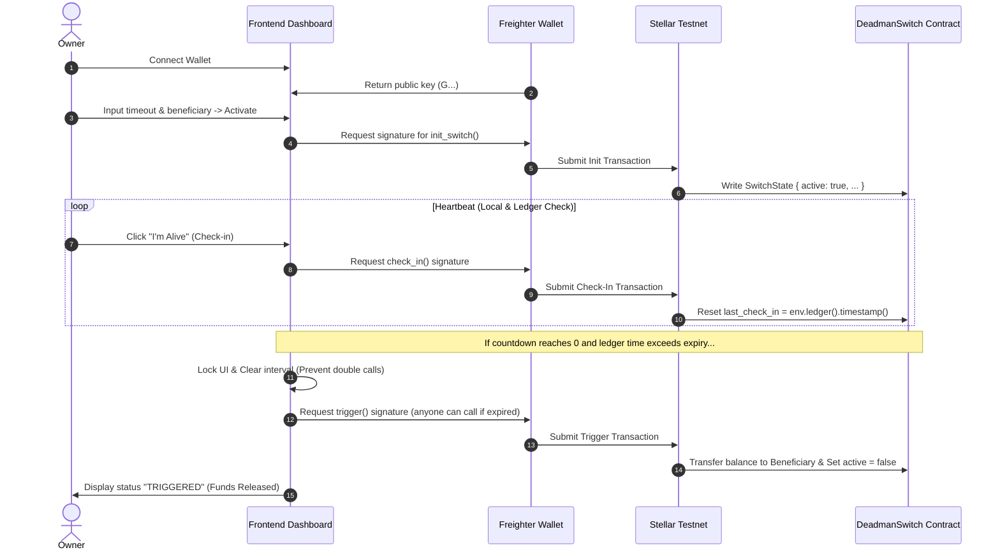

# 🛡️ Secure Switch Protocol (Soroban Deadman Switch)

[](https://stellar.org)
[](https://opensource.org/licenses/MIT)

An advanced, premium-themed, end-to-end Deadman Switch protocol built on the **Stellar Soroban Smart Contract platform**. This application provides a decentralized mechanism to automatically transfer holdings or send alert payloads to a beneficiary address if the owner fails to "check in" before a specified countdown timeout.

Designed with a high-fidelity retro-security terminal aesthetic, the frontend is responsive, animated, and integrates directly with the **Freighter Wallet** for secure on-chain key management and transaction signing.

---

## ⚡ Core Features

1. **On-Chain Security & Authorization**:
   - Built on Rust-based Soroban smart contracts (`lib.rs`).
   - Requires cryptographic owner signatures (`require_auth()`) for initialization, check-ins, and deposit actions.
2. **Authoritative Ledger Timing**:
   - Synchronized completely with Stellar ledger timestamps (`env.ledger().timestamp()`) rather than browser local clocks, eliminating time-drift attacks or browser timer spoofing.
3. **Execution Guard & Double-Trigger Lock**:
   - The frontend implements a strict asynchronous trigger lock preventing duplicate Freighter signing prompts or double-spend attempts upon expiry.
4. **Deposit & Release Capabilities**:
   - The contract supports directly locking XLM/native assets within the switch, which are automatically released to the beneficiary upon successful trigger.
5. **Flexible Lifecycle Management**:
   - Allows explicit owner cancellation/deactivation (`reset_switch`).
   - Allows re-initialization if a previously configured switch has already expired and triggered on-chain.

---

## 🏗️ Architecture & Control Flow



---

## 📂 Project Structure

```
├── app.js               # Frontend application logic, Soroban RPC coordination & XDR decoding
├── index.html           # High-fidelity dashboard interface
├── style.css            # Custom CSS styles (glassmorphism panels, futuristic terminal theme)
├── package.json         # Development server settings
├── .gitignore           # Excludes target build artifacts and node_modules
└── contract/
    ├── src/
    │   └── lib.rs       # Soroban Rust smart contract source code
    ├── Cargo.toml       # Cargo project definition
    └── target/          # Compiled Rust WASM files (git ignored)
```

---

## 🛠️ Getting Started

### 📋 Prerequisites
- **Node.js** (v16+)
- **Freighter Wallet Extension** installed in browser
- **Rust** & **Cargo** (with `wasm32-unknown-unknown` target configured)
- **Stellar CLI** installed for local contract management

### 🚀 Running the Web App Locally

1. Clone this repository to your local machine.
2. Install local development dependencies:
   ```bash
   npm install
   ```
3. Start the local server:
   ```bash
   npm run dev
   ```
4. Open the browser and visit `http://127.0.0.1:3000`.

---

## ⚙️ Smart Contract Methods

The contract compiles to WebAssembly and exposes the following public endpoints:

| Endpoint | Caller | Description |
|---|---|---|
| `init_switch(owner, beneficiary, timeout)` | Owner | Initializes a new switch. Fails if a switch is already active. |
| `check_in(owner)` | Owner | Resets the countdown clock to the current ledger timestamp. |
| `deposit(owner, token, amount)` | Owner | Safely deposits assets into the contract switch wallet. |
| `reset_switch(owner)` | Owner | Explicitly deactivates/cancels the switch. |
| `trigger(owner, token)` | Anyone | If ledger time exceeds `last_check_in + timeout`, transfers contract assets to the beneficiary. |
| `is_expired(owner)` | Anyone | Returns `true` if the switch is active but the window has expired on-chain. |

---

## 🛡️ License

This project is licensed under the MIT License - see the [LICENSE](LICENSE) file for details.
